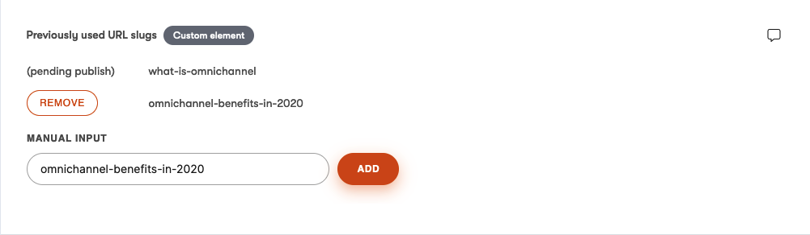

# URL slug history custom element for Kontent by Kentico

This is a [custom element](https://kontent.ai/learn/tutorials/develop-apps/integrate/content-editing-extensions) for [Kontent](https://kontent.ai) that allows users to preserve history of URL slugs.

The element watches the URL slug element and automatically preserves the old URL slug when it gets changed. Apart from that, it also allows manual entry and removal.



## Setup

1. Build the code

```
npm run build
```

1. Deploy the code to a secure public host
    * See [deploying section](#Deploying) for a really quick option

1. Follow the instructions in the [custom elements documentation](https://kontent.ai/learn/tutorials/develop-apps/integrate/content-editing-extensions#a-displaying-your-custom-editor-in-kontent) to add the element to a content model.
    * The `Hosted code URL` is where you deployed to in step 1
    * Add the URL slug element codename into configuration

## Configuration

The custom element may only be used for content types that contain the URL slug element. The configuration of the custom element looks like this:

```
{
    "urlSlugElementCodename": "{codename of your custom element}"
}
```
This configuration is required and the custom element won't work without it.

## Deploying

Netlify has made this easy. If you click the deploy button below, it will guide you through the process of deploying it to Netlify and leave you with a copy of the repository in your GitHub account as well.

[](https://app.netlify.com/start/deploy?repository=https://github.com/ondrabus/kontent-url-slug-history-custom-element)

## What is Saved?

The value is an array of strings (old URL slugs).

```
["old-url-slug", "even-older-url-slug"]
```


